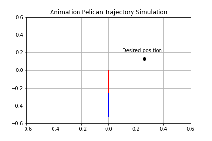

# Pelican Experimental Robot Trajectory Simulation

<p align="center"></p>

 

Trajectory simulation of the Pelican Prototype Robot of the [CICESE Research Center, Mexico](https://www.cicese.edu.mx/). The position control used was PD control with gravity compensation and the 4th order Runge-Kutta method.

## Use the repository
```sh
$ git clone https://github.com/JCLArriaga5/trajectory-simulation-pelican-robot.git
```
## Simulation
The simulation was carried out with a Colab notebook using the functions created in [pelcnrbt](../master/pelcnrbt/), the simulation notebook can be seen [here](../master/simulation_nb/pelican_trajectory_simulation.ipynb).

### Images for desired position (0.26, 0.13)
Graph of error
```python
sim.plot_q_error()
```
<p align="center"></p>

Graph of velocities behavior
```python
sim.plot_velocity_bhvr()
```
<p align="center"></p>

Graph of the trajectory to the desired point
```python
sim.plot_trajectory(50)
```
<p align="center"></p>

### Trajectory Animation
<p align="center"></p>

# References
 Kelly, R., Davila, V. S., & Perez, J. A. L. (2006). Control of robot manipulators in joint space. Springer Science & Business Media.
