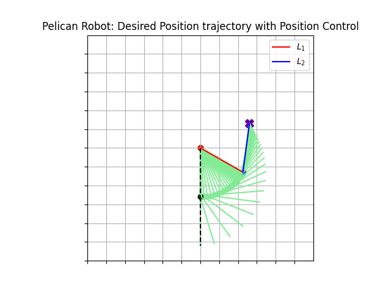

# Pelican Experimental Robot Trajectory Simulation

<p align="center"></p>

 

Trajectory simulation of the Pelican Prototype Robot of the [CICESE Research Center, Mexico](https://www.cicese.edu.mx/). The position control used was PD control with gravity compensation and the 4th order Runge-Kutta method.

## Use the repository
```sh
$ git clone https://github.com/JCLArriaga5/trajectory-simulation-pelican-robot.git
```
## Simulation
You can review the simulation carried out in a Colab notebook using the functions created in [probot](../master/pelcnrbt/probot.py), by clicking here: [](https://colab.research.google.com/drive/1-ScjnXOpJHxfpcLepvf9Jc5cyq6QAOzP?usp=sharing)

or use the shell/command prompt for run simulation in [probot](../master/pelcnrbt/probot.py) Python File:
```sh
:~/trajectory-simulation-pelican-robot$ cd pelcnrbt/
:~/trajectory-simulation-pelican-robot/pelcnrbt$ python probot.py
```

The simulation must be in order:
```python
# Desired position
pd = [0.26, 0.13]
# Gains
kp = [[30.0, 0.0],
      [0.0, 30.0]]
kv = [[7.0, 0.0],
      [0.0, 3.0]]
# Initial values of angles and velocities
qi = [0.0, 0.0]
vi = [0.0, 0.0]
ti = 0.0
tf = 1.0

sim = pelican_robot(pd, kp, kv, control_law='PD-GC')
qsf, qpsf = sim.RK4(ti, qi, vi, tf)
```
`Kp`, `Kv` are symmetric positive definite and selected by the designer and are commonly referred to as position gain and velocity (or derivative) gain, respectively. In form:
```
Kp = diag{kp} = diag{30, 30} [Nm/rad]
Kv = diag{kv} = diag{7, 3} [Nm/rad]
```

the `qi` angles were set to zero to start from home position in this case, if you want it to start from another position you can use the `inverse_k` function which is the robot inverse kinematics which returns the values of `q1` and `q2` for the position you want:
```python
qi = inverse_k(Px, Py)
# Px is the desired x-coordinate
# Py is the desired y-coordinate
```
Once the simulation values have been generated by `RK4` you can use the functions to graph the results.

### Images for desired position (0.26, 0.13)
**Graph of error**: The graph shows how the error of the angles for the desired position was reduced by the controller. The errors shown in the graph are a product of the friction phenomenon that has not been included in the dynamics of the robot.

```python
sim.plot_q_error()
```
<p align="center"></p>

**Graph of velocities behavior**: The graph shows how the speed of each link behaved until reaching the desired position
```python
sim.plot_velocity_bhvr()
```
<p align="center"></p>

**Graph of desired position trajectory**
```python
sim.plot_trajectory(50)
```
<p align="center"></p>

### Simulation Animated
If you want to see the animation of the trajectory to the desired position and the behavior of the error during the set time, use the parameter `display=True` in the RK4 function, as show:
```python
sim = pelican_robot(pd, kp, kv, control_law='PD-GC')
qsf, qpsf = sim.RK4(ti, qi, vi, tf, display=True)
```

<p align="center"></p>

# References
 Kelly, R., Davila, V. S., & Perez, J. A. L. (2006). Control of robot manipulators in joint space. Springer Science & Business Media.
